# AssetFlow — Entity Relationship Diagram

Rendered with Mermaid (GitHub renders this natively).

```mermaid
erDiagram
    roles ||--o{ users : "has"
    roles ||--o{ role_permissions : ""
    permissions ||--o{ role_permissions : ""
    users ||--o{ refresh_tokens : "owns"
    users |o--o| employees : "linked to"

    departments ||--o{ employees : "staffs"
    locations ||--o{ employees : "hosts"
    locations |o--o{ locations : "parent of"

    asset_categories |o--o{ asset_categories : "parent of"
    asset_categories ||--o{ assets : "classifies"
    locations ||--o{ assets : "holds"
    assets ||--o{ asset_images : "has"
    assets ||--o{ asset_documents : "has"
    assets ||--o{ asset_status_history : "transitions"

    assets ||--o{ asset_allocations : "allocated via"
    employees ||--o{ asset_allocations : "receives"
    users ||--o{ asset_allocations : "allocated by"

    assets ||--o{ transfer_requests : "moved via"
    locations ||--o{ transfer_requests : "from / to"
    users ||--o{ transfer_requests : "requested / decided by"

    locations ||--o{ resources : "hosts"
    resources ||--o{ bookings : "booked via"
    users ||--o{ bookings : "booked by"

    assets ||--o{ maintenance_requests : "serviced via"
    users ||--o{ maintenance_requests : "reported / decided by"
    maintenance_requests ||--o{ maintenance_assignments : "assigned via"
    employees ||--o{ maintenance_assignments : "works on"

    audit_cycles ||--o{ audit_items : "contains"
    assets ||--o{ audit_items : "checked in"
    locations |o--o{ audit_cycles : "scoped to"

    users ||--o{ notifications : "receives"
    users |o--o{ activity_logs : "performed"
```



## Key design decisions

| Decision | Why it matters |
|---|---|
| Partial unique index `uq_active_allocation (asset_id) WHERE returned_at IS NULL` | Double allocation is impossible **at the database level**, even under concurrent requests. |
| `EXCLUDE USING gist (resource_id WITH =, tstzrange(...) WITH &&)` on bookings | Booking overlap is rejected by PostgreSQL itself — race-condition proof, no app-only check. |
| `asset_status_history` append-only table | Complete, immutable asset lifecycle audit trail. |
| CHECK constraints on every status column | Invalid workflow states can never be persisted. |
| Partial unique index `uq_open_transfer` | An asset can have only one open (pending/approved) transfer at a time. |
| `ON DELETE RESTRICT` on operational FKs | Master data with history can't be silently destroyed; soft-delete via `is_active`. |
| `GENERATED ALWAYS AS IDENTITY` PKs, `TIMESTAMPTZ` everywhere | Modern, timezone-safe PostgreSQL conventions. |
| `JSONB details` on activity_logs | Flexible structured payloads without schema churn. |
```
